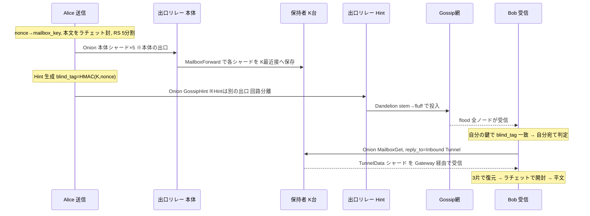

# AETHER

> **English:** [README_en.md](README_en.md) · Design document: [docs/whitepaper.md](docs/whitepaper.md)

**匿名 P2P ネットワーク**

私信メッセンジャーと公開ファイル共有・掲示板を、**1つの匿名基盤**の上に載せた Rust 実装です。「誰が・誰に・何を送ったか」をネットワーク観測から隠し、押収に耐え、コンテンツを消えなくします。

> ⚠️ **研究・実装段階のプロジェクトです。** 実運用のセキュリティ監査は未了。実際の匿名性が要る用途にそのまま使わないでください。

---

## 目次

- [脅威モデル](#脅威モデル)
- [クイックスタート](#クイックスタート)
- [ネットワークの流れ（詳細）](#ネットワークの流れ詳細)
  - [0. 構成要素](#0-構成要素)
  - [1. リング座標と保持者の決定](#1-リング座標と保持者の決定)
  - [2. Onion ルーティングと回路分離](#2-onion-ルーティングと回路分離)
  - [3. Schrödinger Mailbox（本体の配置）](#3-schrödinger-mailbox本体の配置)
  - [4. Hint と Broadcast Veil（宛先の告知）](#4-hint-と-broadcast-veil宛先の告知)
  - [5. Dandelion++（放流元の秘匿）](#5-dandelion放流元の秘匿)
  - [6. Inbound Tunnel（匿名の返信）](#6-inbound-tunnel匿名の返信)
  - [7. 私信の全体フロー](#7-私信の全体フローsend--receive)
  - [8. 公開モード（板 / 索引 / チャンク / 掲示板）](#8-公開モード板--索引--チャンク--掲示板)
  - [9. 前方秘匿と X3DH](#9-前方秘匿と-x3dh)
  - [10. エポックビーコン](#10-エポックビーコン)
  - [11. ピア発見と NAT 越え](#11-ピア発見と-nat-越え)
  - [12. 押収対策（保存時暗号化）](#12-押収対策保存時暗号化)
- [CLI リファレンス](#cli-リファレンス)
- [守れるもの・守れないもの](#守れるもの守れないもの)
- [実装状況](#実装状況)
- [ビルドとテスト](#ビルドとテスト)
- [リポジトリ構成](#リポジトリ構成)

---

## 脅威モデル

AETHER が想定する敵は **日本の警察型の攻撃者**です：

```
監視ノードを網に参加させる → IP を特定する → ISP へ照会 → 端末を押収 → フォレンジック
```

**グローバル受動盗聴者（全リンクを同時に見られる敵）は想定しません。** 設計はすべて次の3点に振っています：

1. **IP 特定を防ぐ** ── 発信者・受信者・保持者の IP を、網を観測しても紐付けられない。
2. **押収に耐える** ── 端末を押さえられても、パスフレーズ無しには何も読めない。過去メッセージは前方秘匿で復元不能。
3. **消せなくする** ── コンテンツは複数ノードに分散複製され、取得されるほど生き延びる。

この違いは重要です。たとえば後述のエポックビーコン取得や STUN は「外部への接続」という足跡を残しますが、これは**グローバル盗聴者には効いても、参加型の警察には onion/tunnel が守る IP 匿名性を崩さない**、という判断で許容しています。

---

## クイックスタート

**手元で試す（テスト網を一発で立てる）**

```bash
scripts/local-net.sh          # 127.0.0.1 に到達可能なリレーを 5 台立てる（種は 127.0.0.1:19001）
```

**CLI で使う**

```bash
# ビルド
cargo build --release

# 鍵を生成（NodeId が決まる）
cargo run -p aether-cli -- init

# 自分の NodeId を確認
cargo run -p aether-cli -- id

# 種ノードに参加して常駐（リレー兼受信）。板を購読すると、その板の投稿を拾って表示する
cargo run -p aether-cli -- start --connect <種>:<port> --subscribe 雑談

# 私信を送る（相手の NodeId を知っていれば事前共有は不要。X3DH で自動鍵合意）
cargo run -p aether-cli -- send --to <NodeId> --message "やあ" --connect <種>:<port>

# 公開の板に投稿・検索・取得（公式の板は名前で指定。非公開板は aether-board:<ID>）
cargo run -p aether-cli -- send   --board 雑談 --file movie.mkv --connect <種>:<port>
cargo run -p aether-cli -- search --board 雑談                  --connect <種>:<port>
cargo run -p aether-cli -- get    --board 雑談 --ref <ref> --out movie.mkv --connect <種>:<port>
```

> バイナリ名は `aether-cli` ですが CLI 上は `aether` として振る舞います。`cargo install --path cli` 後は `aether ...` で起動できます。

**押収対策を有効にするには** 環境変数 `AETHER_PASSPHRASE` を設定してから実行します（identity・連絡先鍵・Mailbox をすべて暗号化）：

```bash
export AETHER_PASSPHRASE='あなたのパスフレーズ'
cargo run -p aether-cli -- start --connect <種>:<port>
```

**GUI（デスクトップ）で使う**

```bash
cd gui
npm install   # Tauri CLI（画面は素の HTML/JS でバンドラを使わない）
npm run dev   # 開発起動
```

種ノードのアドレスを入れて「参加する」を押すだけ。詳しくは [`gui/README.md`](gui/README.md)。

---

## ネットワークの流れ（詳細）

ここが AETHER の心臓部です。**「発信者の IP を隠したまま、宛先を知る者だけが受け取れる」** をどう実現しているかを、パケットの旅として追います。

### 0. 構成要素

| 要素 | 役割 |
|---|---|
| **NodeId** | Ed25519 公開鍵（32B）。ノードの ID かつリング座標の素。生成に **Argon2id PoW** を課し、大量生成（Sybil）を重くする |
| **Directory（リレーリスト）** | 各ノードがローカルに持つ「既知リレーの名簿」。Tor の consensus に相当。**問い合わせずに**ここから保持者を計算する |
| **Ring 座標** | NodeId・コンテンツ・シャードを `[0,1)` の円環上の点に写す決定論的ハッシュ。近い者が担当を持つ |
| **Onion 回路** | 多層暗号のトンネル。各ホップが1層だけ剥がし、次のホップしか知らない。出口リレーが網への注入点になる |
| **Schrödinger Mailbox** | 本体を Reed-Solomon で割って複数ノードに分散保管する層。保持者は中身も宛先も読めない |
| **Hint** | 「どこかに君宛てのものが置かれた」を告げる小さな暗号化パケット。**全ノードに配られる**が、鍵を持つ者だけが自分宛てと分かる |
| **Inbound Tunnel** | 受信者が事前に張っておく返信専用の片方向トンネル。Mailbox に自分の IP を見せずに応答を受ける |

すべての鍵導出は **SHA-256 / HKDF** をドメイン分離タグ付きで使います。

### 1. リング座標と保持者の決定

Kademlia の反復探索（FIND_VALUE）は**使いません**。それをやると「誰が何を探しているか」が観測されてしまうからです（受信者匿名性の破壊）。

代わりに、座標を**決定論的に導出**し、担当は**各ノードがローカルで計算**します。ネットワークへは一切問い合わせません。

```
リレーの位置        = H("aether_ring_node_v1"    ‖ NodeId ‖ epoch_seed)
Mailbox の位置      = H("aether_ring_mailbox_v1" ‖ mailbox_key ‖ K)
シャード i の位置   = H("aether_ring_shard_v1"   ‖ mailbox_key ‖ K ‖ i)
Hint backlog の位置 = H("aether_ring_hint_v1"    ‖ hint_id ‖ epoch_seed)
```

```
   0.0 ───────────────────────────── 1.0 （円環・端は繋がる）
        ●R1      ●R3        ●R2   ●R4
                    ▲ Mailbox位置 M = H(mailbox_key ‖ K)
                    └── M に近い K=5 台が保持者（K最近接）
```

**核心は `K`（Hint の復号鍵）を位置計算に混ぜている**点です。私信では `K` は当事者しか知らないので、**保持者の位置は第三者には原理的に計算不能**。Gossip を全部見ても「誰がどのコンテンツの保持者か」を列挙できません。送信側と受信側だけが独立に同じ集合へ到達します。

- **RS 3+2 シャーディング**（`DATA_SHARDS=3, PARITY_SHARDS=2`）：本体を5片に割り、**3片あれば復元**。
- シャードごとに**独立した座標**を使うのでリング全体に散る。攻撃者が円環の一弧を支配しても取れるのは1片で、復元には届かない。
- 各シャードを **K=5 台**に複製。可用性と Sybil 露出のトレードオフ。

### 2. Onion ルーティングと回路分離

発信者の IP を隠すため、本体も Hint も **Onion 回路**を通します。素で流すと最初のリレーに発信元が割れます。

```
Alice ──[3層暗号]──▶ ホップ1 ──[2層]──▶ ホップ2 ──[1層]──▶ 出口リレー
                       (次だけ知る)      (次だけ知る)      ここで最終層を剥がし、
                                                            中身の種別で振り分ける
```

出口リレーは剥がした中身の **InnerPacketType** を見て動きます：

- `MailboxForward` … 指定 Mailbox へ本体を転送（出口 ≠ Mailbox を強制。同一だと位置が決定論的なので Sybil で狙い撃ちされる）
- `GossipHint` … Gossip 網へ Hint を投入（＝放流の発生点）
- `TypedForward` … 任意種別（例: `MailboxGet`）を隠したまま転送

**回路分離（重要）**：私信の送信では**本体 PUT と Hint 放流で別々の出口**を使います。同じ出口だと「本体を置いた者と Hint を流した者は同一」が出口を取られた瞬間に確定し、時間分離の意味が消えるためです。

### 3. Schrödinger Mailbox（本体の配置）

送信者が本体を「置く」流れ：

```
1. nonce ← 乱数32B ;  mailbox_key = SHA256(nonce)
2. 本体を鍵で暗号化（私信は前方秘匿ラチェット / 公開は板の静的 board_key）
3. Reed-Solomon で 5 シャードに分割
4. 各シャードに HMAC の「封」をする（mailbox_key を含む）
     └─ 封が無いと、保持者1台が偽シャードを返すだけで復元が止まる（RS は消失訂正）
5. シャード i を「H(mailbox_key ‖ K ‖ i) に近い K 台」へ Onion 経由で配置
```

保持者側は **no-burn + アクセス連動 TTL**（設計 18.3-B）：

- 取得しても**消さない**。「1回取りに行くと消える／取りに来ただけで検閲される」を防ぐ。
- 参照されるほど TTL が延び、放置されたものは自然消滅する。
- ダウンローダは復元に成功したシャードを**現在の K 最近接へ置き直す**（reseed）。これで元の保持者が落ちてもコンテンツが生き続け、**人気なほど保持者が増える**＝Winny の「消えない」性質。

### 4. Hint と Broadcast Veil（宛先の告知）

本体を置いただけでは受信者は気づけません。そこで **Hint** を流します。

```
Hint = { blind_tag(4B), nonce(12B), 暗号文, TTL }
       blind_tag = HMAC(K, hint_nonce)[0..4]
       暗号文     = Enc_K( { mailbox_key の素 nonce, message_id, timestamp } )
```

**Broadcast Veil（設計の前提）**：Hint は **gossip フラッドで全ノードに配られます**。各ノードは受け取った Hint に対し、自分の連絡先ごとの `K` で `blind_tag` を試算し、一致したものだけを**手元で**「自分宛て」と判定します。

```
   Hint ──flood──▶ 全ノード
                    各自: for K in 自分の鍵:
                             if HMAC(K, nonce)[0..4] == blind_tag: 自分宛て！
```

これにより **「誰宛ての Hint か」はネットワーク上に一切現れません**。宛先の判定は完全にローカル。TTL（既定 5）で拡散が減衰し、`GOSSIP_FANOUT=3` 台へ中継、`id` で重複排除します。

さらに、Hint を取りこぼしたノード（オフライン明け等）のために **分散 Hint backlog**（`H(hint_id)` の K 最近接が24h保持）があり、digest 差分同期で追いつけます。

### 5. Dandelion++（放流元の秘匿）

Onion で発信者 IP は隠れていますが、Hint は**出口リレーで gossip に投入**されるため、gossip を観測する敵は「この Hint は出口 X で最初に現れた」を学べます。Sybil で出口を多数握れば発生源に迫れる。

**Dandelion++** は投入を2相に分けます：

```
stem（茎）相:  ●→●→●→●   単一のランダムな後継へ1本道で中継（誰が最初かが線に埋もれる）
fluff（綿毛）相:      ●   各ホップが確率 25% で通常の gossip フラッドへ切替（期待ステム長 4）
```

- ステム後継は**エポック内で固定**（毎回引き直すと交差攻撃で発生源が絞られる）。
- 送り主は次候補から除外（経路が戻らない）。
- **echo/再送（黒穴対策）**：後継へ `StemHint` を送ったら `StemAck` を待つ。返らなければその後継は黒穴とみなし**別の後継へ再送**。生きた後継が尽きたら自分で fluff して**配送を必ず保証**する。ACK は最適化で、配送保証は fluff フォールバックが担う。

### 6. Inbound Tunnel（匿名の返信）

受信者が本体を取りに行くとき、Mailbox から直接返させると**受信者の IP が Mailbox に割れます**（「誰が何を取りに来たか」は受信者匿名性の直接の破壊）。

そこで受信者は**事前に片方向の返信トンネル**を張り、その入口（Gateway）と tunnel_id だけを要求に同梱します：

```
受信者 ──MailboxGet{ shard_key, reply_to=(Gateway, tunnel_id) }──▶ 保持者
保持者 ──TunnelData{ tunnel_id, シャード }──▶ Gateway ──▶ … ──▶ 受信者の手元Mailbox
受信者: 自分の Mailbox から tunnel_id 宛てメッセージを回収して復号
```

保持者から見える相手は **Gateway の IP** だけ。要求も応答も onion/tunnel の中です。

### 7. 私信の全体フロー（send → receive）

以上を1本につなぐと、私信1通の旅はこうなります：



**この間、ネットワーク上のどこにも「Alice→Bob」という関係は現れません。** 出口リレーは発信元を知らず、保持者は宛先も中身も読めず、Gossip 観測者には宛先が見えず、Mailbox には受信者の IP が Gateway でマスクされます。

### 8. 公開モード（板 / 索引 / チャンク / 掲示板）

私信は「特定の相手」宛てですが、公開共有には特定の宛先がありません。そこで**板（board）を乱数 32 バイトの ID** で表します：

```
board_key = H("aether_board_key_v1" ‖ BoardId)   ← BoardId（ID）を知る全員が同じ鍵に到達
```

`board_key` を私信の `K` と同じ位置に使うので、**同じ機構がそのまま公開共有になります**（BoardId を知る＝復号鍵を持つ＝保持者位置を計算できる）。BoardId は乱数なので辞書攻撃で当てられません。**推測ではなく ID を渡された者だけが板に入れます**（公式の板は ID をアプリに埋め込んであるので誰でも読める。5ch と同じで「誰が書いたか」だけを守る）。ラベル（表示名）は重複しうるので、ID から作る短い指紋を必ず並べて見せます。

- **索引層（pull 発見）**：`H(index_key ‖ board_key)` に、**board_key で封じた記述子**（本体へのポインタ・数十バイト）を追記。購読して待たなくても、板の索引を**引きに行けば**発見できる。保持者は記述子を暗号文のまましか持たない（ファイル名も見えない）。各記述子は **スパム対策 PoW** を持ち、`search` はこれを**熱量ランク**（PoW を積んだ議論が上位）に使う。
- **チャンク化（大容量・swarm）**：`CHUNK_SIZE=256KB` で分割し、**収束暗号**（nonce = H(secret‖平文)）で content-address 化。同一ファイルの再公開は**重複排除**され、複数保持者から**並列取得**できる。Manifest がチャンク列を束ねる。
- **掲示板 DAG**：記述子が親の `content_ref` を参照して **DAG** を成す（木ではなく DAG ＝ 同時に書かれた複数の先端を後続がまとめられる）。全ノードが**決定論的トポロジカル順**（Kahn 法）で同じスレッド並びを再現し、HN 式スコア（累積 PoW ÷ 時間の重力）で熱量順に表示する。

### 9. 前方秘匿と X3DH

私信の**本文**は Signal 由来の **Double Ratchet** で封じます（送受信ごとに鍵が前進し、使い終えた鍵は破棄）。押収されても**送受信し終えた過去メッセージは復元不能**。

初回接触の初期秘密は **X3DH**（非同期鍵合意）で確立します：

```
受信側 Bob: プレキー束（署名付きプレキー + 耐量子KEM公開鍵）を
            H("aether_prekey_v1" ‖ BobのNodeId) に公開しておく
送信側 Alice: 束を取得 → 一時鍵 + Bobのプレキー + ML-KEM で初期秘密 SK を計算
            → 初回本文に InitialMessage を前置して送る
Bob: InitialMessage から同じ SK を復元 → 以降はラチェットで会話
```

- **耐量子ハイブリッド**：X25519 に加え **ML-KEM(Kyber768)** の共有秘密を混ぜる（harvest-now-decrypt-later 対策）。
- **署名は SK でなくプレキーにだけ**掛かる（否認可能性）。署名は署名付きプレキー・KEM公開鍵・ID鍵の3点を1つで覆い、MITM の差し替えを弾く。
- **認識と本文の分離**：Hint 認識（blind_tag）と Mailbox 位置は、相手の NodeId から自動合意する静的鍵（`identity.agree`）のまま。前方秘匿は**本文だけ**に掛ける。だから X3DH 配線は既存フローへの**追加**であって作り直しではない。
- `--to <NodeId>` だけで送れます（`--secret` の手渡しは不要。省略時は自動鍵合意）。

### 10. エポックビーコン

リング座標には**日次で変わる公開乱数 `epoch_seed`** を混ぜられます（`--epoch-beacon`、既定 OFF）。これで**位置グラインディング**（狙った mailbox_key の隣に着地する NodeId を鍵ガチャで選ぶ攻撃）を、1日で無効化します。

- ソースは **drand（League of Entropy）**。エポック開始時刻に対応するラウンド番号は**全ノードが決定論的に一致**するので、同じ seed に到達する。
- **全ノード一致が必須**（seed が食い違うと保持者計算がずれて網が分裂する）＝これは網全体で揃える protocol フラグで、個別 opt-in はできない。
- 取得失敗時は placeholder に戻さず**現在の seed を据え置く**（分裂回避）。回転で保持者が変わったコンテンツは既存の republish ループが移行を吸収する。
- 現状 `randomness == SHA256(signature)` の整合性のみ確認（真正性 BLS 検証は後段）＝取得は TLS 信頼。

### 11. ピア発見と NAT 越え

- **PEX**：種ノード1台から始めて、リレー同士が名簿を交換し網全体へ収束（進捗ベースのバックオフ）。
- **到達性の等級（Tier）**：STUN / ポートマッピングで自分の到達性を判定し名簿で共有。届かないノードを Mailbox やガードに選んで配送を落とさないため。
- **Connection Reversal**：NAT 内ノードは「相手が張った接続」の上で押し返して保持者になれる。これが無いと NAT 内ノードは名簿に載れず、否認可能性が構造的に消える。
- **ホールパンチング**：仲介役を挟んだ UDP 穴あけ（守るべきクライアント→ガードの punch は仲介しない）。
- **ガードノード**：入口を固定して「生涯に一度でも敵ガードを引く確率」を最小化。

### 12. 押収対策（保存時暗号化）

`AETHER_PASSPHRASE` を設定すると、ディスク上の状態を **Argon2id → ChaCha20-Poly1305** で暗号化します：

| ファイル | 中身 | 暗号化 |
|---|---|---|
| `identity.key` | Ed25519 秘密鍵（＝ID そのもの） | `[AEIK][salt][nonce][ct]` 80B・誤パスは拒否 |
| `keystore.db` | 連絡先ごとのラチェット状態・自分のプレキー秘密 | 値ごとに暗号化・カナリアで誤パス検出 |
| `mailbox.db` | 保持中のシャード・索引・トンネル本文 | 値ごとに暗号化 |

パスフレーズ無しには**成りすましも過去の連絡先状態の読み出しもできません**。ラチェットの前方秘匿と合わせ、押収時点で「これから使う鍵」しか残らない設計です。

---

## CLI リファレンス

```
aether init [--force]                             鍵を生成（既存を上書きは --force）
aether id                                         保存済み NodeId を表示

aether start [オプション]                          常駐（リレー兼受信）
    --port <u16>            待ち受けポート（既定 0 = 初回にランダムに選んで保存）
    --connect <host:port>  種ノード
    --advertise <host:port> 到達可能アドレスを宣言（省略時 STUN 自動判定）
    --allow-port-mapping   ルータへのポートマッピングを許可（痕跡が残る・既定オフ）
    --pow-difficulty <u32> NodeId PoW 難易度（既定 16）
    --contact <NodeId[:hex]>  受信したい相手（複数可。秘密省略で自動鍵合意）
    --subscribe <board>       購読する板（公式の板の名前か aether-board:…、複数可）
    --epoch-beacon            エポックビーコンを有効化（網全体で揃える必要あり）

aether send [オプション]                           送信（私信 or 公開）
    --to <NodeId>          私信の宛先（--secret 省略で自動鍵合意 → X3DH 初回接触）
    --secret <hex>         事前共有秘密を明示（任意）
    --board <雑談 | aether-board:…>   板への書き込み（--to と排他）
    --message <text> | --file <path>   本文 or ファイル
    --name <text>          索引の見出し（省略時は本文先頭 or ファイル名）
    --reply-to <ref[,ref]> 掲示板のスレッド返信（親の content_ref）
    --connect <host:port>  種ノード（必須）
    --min-relays <n>       この台数を超えるまで待つ（既定 3）

aether search --board <雑談 | aether-board:…> --connect <host:port>   索引を引いてスレッド DAG 表示
aether get --board <雑談 | aether-board:…> --ref <hex> [--out <path>] --connect <host:port>   取得

環境変数 AETHER_PASSPHRASE   設定すると identity / keystore / mailbox を保存時暗号化
```

---

## 守れるもの・守れないもの

**守れる（対 参加型の警察）**
- 発信者・受信者・保持者の IP 紐付け（onion + inbound tunnel + K混入位置）
- 「誰宛ての Hint か」（blind_tag のローカル判定）
- 放流の発生源（Dandelion++）
- 押収時の過去メッセージ（Double Ratchet の前方秘匿 + 保存時暗号化）
- 検閲耐性（分散複製 + reseed + no-burn）

**守れない / 未対応（正直に）**
- **グローバル受動盗聴者**（全リンク同時観測でのタイミング相関）は脅威モデル外
- 公式の板の ID はアプリに埋め込んであり、公開コンテンツの保持者位置は誰でも計算できる（検索可能性との交換。非公開板は乱数 ID なので、ID を渡された者以外は保持者位置を計算できない）
- エポックビーコン取得・STUN は外部への接続の足跡を残す（将来 Tor/網内伝播で軽減可）
- **未承諾の初回接触**は現状 v1 では相互 `--contact` 前提（受信箱チャネルは follow-on）
- セキュリティ監査・実 NAT 環境での大規模検証はこれから

---

## 実装状況

**Phase 0–2 完了**：Hint PoW / 分散 backlog（オフライン受信）/ 回路分離 / 公開モード / 永続化ループ / 索引層（pull 発見）/ チャンク化 + content-addressing / 掲示板スレッド DAG / PoW 熱量ランク / 死んだリレーの eviction。

**Phase 3 完了**：
- ① 前方秘匿（Double Ratchet を私信に配線）
- ② Dandelion++（stem/fluff + echo 再送で黒穴でも配送保証）
- ③ 自動鍵合意（`--secret` 手渡しの排除）+ **full prekey X3DH 配線**（プレキー公開/取得・InitialMessage・実網実証）
- ④ 耐量子ハイブリッド（X25519 + ML-KEM を X3DH に）
- 保存時暗号化（identity / keystore / mailbox）
- エポックビーコン（drand・opt-in）

**残り（roadmap）**：使い捨てプレキー（OPK）プール / 未承諾初回接触の受信箱チャネル / エポックの BLS 検証 or 網内伝播（drand 足跡の除去）/ FU ボタン / 実 NAT 検証 / セキュリティ監査。

lib + integration テストと clippy 0 を CI 前提にしている（`cargo test` / `cargo clippy --all-targets`）。

---

## ビルドとテスト

```bash
cargo build --release            # ビルド
cargo test                       # 全テスト（実ネットは #[ignore]）
cargo clippy --all-targets       # lint
cargo test -p aether-core --lib epoch -- --ignored   # drand 実疎通（要ネット）
```

必要環境：Rust 1.93+（edition 2024）。

---

## リポジトリ構成

```
core/                Rust ライブラリ本体（部品：回路・Mailbox・トンネル）
  src/crypto/        identity(Ed25519/PoW) · ratchet · session · x3dh · keyword(板の識別子) · cipher · pow
  src/net/           quic · onion · relay · tunnel · gossip(_server) · dandelion · ring
                     relay_list(directory) · epoch(drand) · pex · punch · reachability · guard …
  src/node/          server(パケット処理) · router · peer
  src/mailbox/       schrodinger(配置/取得) · sharding(RS) · index · chunk · board(DAG) · server(sled)
  src/storage/       keystore(ラチェット/プレキー永続化) · at_rest(Argon2id+ChaCha20)
  src/protocol/      wire(パケット型) · hint
  tests/             e2e_*（gossip 伝播 / トンネル / 回路分離 / bootstrap …）
client/              aether-client（送る・探す・取る・受けるの手順。CLI と GUI が共有）
  src/keys.rs        鍵ファイルと、暗号化して小さな設定を保存する write_secure/read_secure
  src/friends.rs     友だち一覧（表示名は自分の端末にだけ置く）
  src/boards.rs      板・お気に入り（公式の板 + 入った/作った非公開板）
  src/talks.rs       トーク履歴の暗号化保存
cli/                 aether-cli（init/id/start/send/search/get）。引数解析と表示だけ
gui/                 AETHER デスクトップ（Tauri 2）。詳しくは gui/README.md
  src-tauri/         画面から呼べるコマンド（別ワークスペース。本体には含めない）
  ui/                素の HTML/JS 画面（バンドラを使わない）
scripts/local-net.sh 手元で試すテスト網を一発で立てる（127.0.0.1 に到達可能なリレー N 台）
.docs/               設計文書（詳細実装計画・設計判断の「なぜ」）
```

---

*AETHER は研究プロジェクトです。ライセンスは MIT / Apache-2.0 のデュアル。*
